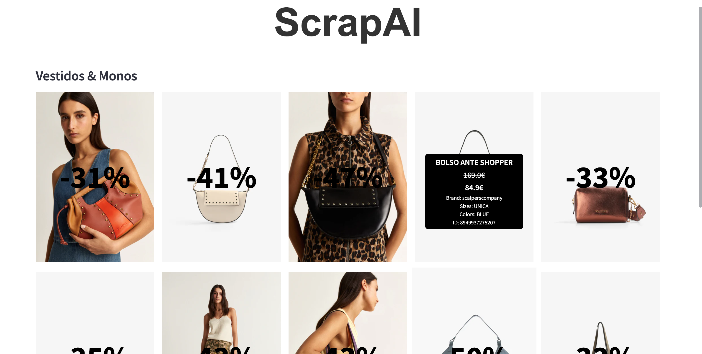

# ScrapAI - Cloth Products Scraping and Visualization

## Overview

ScrapAI is a Python application designed to scrape product data from the Scalpers Company website, focusing on various categories such as clothing, shoes, bags, accessories, and more. It utilizes web scraping techniques with BeautifulSoup and requests libraries to gather product information like name, price, discounts, sizes, and colors. The scraped data is then visualized using Streamlit for easy exploration and filtering.

## Features

* Scraping Categories: Choose from a wide range of categories like dresses, skirts, shirts, sneakers, bags, etc., to scrape product data.
* Filtering: Filter products based on price range and discount percentage.
* Interactive Visualization: Display scraped products with images, prices, discounts, and details in an interactive Streamlit web * application.
* Dynamic Updates: Real-time updates on product data when filters are applied or new categories are selected.

### Requirements

* Python 3.6+
* Libraries listed in requirements.txt

